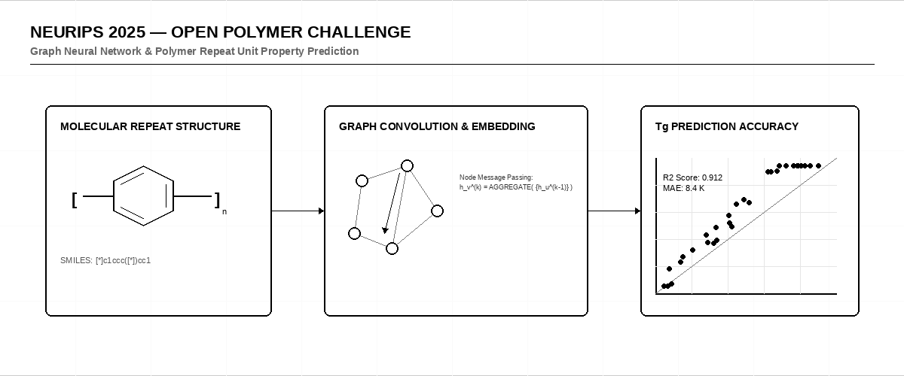

# ⚗️ NeurIPS 2025 — Open Polymer Challenge

     

> [!IMPORTANT]
> **Host:** `University of Notre Dame & University of Wisconsin-Madison`  
> **Platform Link:** [Kaggle Competition](https://www.kaggle.com/competitions/neurips-2025-open-polymer-challenge)  
> **Dataset Link:** [Kaggle Dataset](https://www.kaggle.com/competitions/neurips-2025-open-polymer-challenge/data)  
> **Domain:** `Materials Science & Chemistry`

## 📖 Overview

Predicting chemical and physical properties of polymers (like glass transition temperatures) from SMILES strings. Really interesting materials science regression problem.

## ⚙️ Standard Pipeline Workflow

## 🗂️ Notebook Architecture & Inventory

### 📂 Inference & Submission
*Prediction pipeline and Kaggle submission file generation.*

| Script / Notebook | Type | Versions | Average Size | Core Stack / Techniques |
|:------------------|:-----|:---------|:-------------|:------------------------|
| 📄 [Inference](./Inference%20%26%20Submission/Inference.ipynb) | Single Notebook | `v1` | `82 KB` | `PyTorch, Scikit-Learn Split` |
| 📄 [Inference_2](./Inference%20%26%20Submission/Inference_2.ipynb) | Single Notebook | `v1` | `32 KB` | `PyTorch, Scikit-Learn Split` |
| 📁 **Inference_3** | Multi-Version Script | [v1](./Inference%20%26%20Submission/Inference_3/v1.ipynb), [v2](./Inference%20%26%20Submission/Inference_3/v2.ipynb), [v3](./Inference%20%26%20Submission/Inference_3/v3.ipynb), [v4](./Inference%20%26%20Submission/Inference_3/v4.ipynb), [v5](./Inference%20%26%20Submission/Inference_3/v5.ipynb), [v6](./Inference%20%26%20Submission/Inference_3/v6.ipynb) | `Avg 1117 KB` | `PyTorch, Scikit-Learn Split` |
| 📁 **Inference_4** | Multi-Version Script | [v1](./Inference%20%26%20Submission/Inference_4/v1.ipynb), [v2](./Inference%20%26%20Submission/Inference_4/v2.ipynb), [v3](./Inference%20%26%20Submission/Inference_4/v3.ipynb) | `Avg 172 KB` | `PyTorch, Scikit-Learn Split` |
| 📁 **LightGBM_LightGBM_XGBoost_XGBoost_CatBoost_Inference** | Multi-Version Script | [v1](./Inference%20%26%20Submission/LightGBM_LightGBM_XGBoost_XGBoost_CatBoost_Inference/v1.ipynb), [v10](./Inference%20%26%20Submission/LightGBM_LightGBM_XGBoost_XGBoost_CatBoost_Inference/v10.ipynb), [v11](./Inference%20%26%20Submission/LightGBM_LightGBM_XGBoost_XGBoost_CatBoost_Inference/v11.ipynb), [v12](./Inference%20%26%20Submission/LightGBM_LightGBM_XGBoost_XGBoost_CatBoost_Inference/v12.ipynb), [v13](./Inference%20%26%20Submission/LightGBM_LightGBM_XGBoost_XGBoost_CatBoost_Inference/v13.ipynb), [v14](./Inference%20%26%20Submission/LightGBM_LightGBM_XGBoost_XGBoost_CatBoost_Inference/v14.ipynb), [v15](./Inference%20%26%20Submission/LightGBM_LightGBM_XGBoost_XGBoost_CatBoost_Inference/v15.ipynb), [v16](./Inference%20%26%20Submission/LightGBM_LightGBM_XGBoost_XGBoost_CatBoost_Inference/v16.ipynb), [v17](./Inference%20%26%20Submission/LightGBM_LightGBM_XGBoost_XGBoost_CatBoost_Inference/v17.ipynb), [v18](./Inference%20%26%20Submission/LightGBM_LightGBM_XGBoost_XGBoost_CatBoost_Inference/v18.ipynb), [v19](./Inference%20%26%20Submission/LightGBM_LightGBM_XGBoost_XGBoost_CatBoost_Inference/v19.ipynb), [v2](./Inference%20%26%20Submission/LightGBM_LightGBM_XGBoost_XGBoost_CatBoost_Inference/v2.ipynb), [v3](./Inference%20%26%20Submission/LightGBM_LightGBM_XGBoost_XGBoost_CatBoost_Inference/v3.ipynb), [v4](./Inference%20%26%20Submission/LightGBM_LightGBM_XGBoost_XGBoost_CatBoost_Inference/v4.ipynb), [v5](./Inference%20%26%20Submission/LightGBM_LightGBM_XGBoost_XGBoost_CatBoost_Inference/v5.ipynb), [v6](./Inference%20%26%20Submission/LightGBM_LightGBM_XGBoost_XGBoost_CatBoost_Inference/v6.ipynb), [v7](./Inference%20%26%20Submission/LightGBM_LightGBM_XGBoost_XGBoost_CatBoost_Inference/v7.ipynb), [v8](./Inference%20%26%20Submission/LightGBM_LightGBM_XGBoost_XGBoost_CatBoost_Inference/v8.ipynb), [v9](./Inference%20%26%20Submission/LightGBM_LightGBM_XGBoost_XGBoost_CatBoost_Inference/v9.ipynb) | `Avg 57 KB` | `LightGBM, XGBoost, CatBoost` |
| 📁 **LightGBM_LightGBM_XGBoost_XGBoost_CatBoost_SVM_DecisionTree_Inference** | Multi-Version Script | [v1](./Inference%20%26%20Submission/LightGBM_LightGBM_XGBoost_XGBoost_CatBoost_SVM_DecisionTree_Inference/v1.ipynb), [v2](./Inference%20%26%20Submission/LightGBM_LightGBM_XGBoost_XGBoost_CatBoost_SVM_DecisionTree_Inference/v2.ipynb), [v3](./Inference%20%26%20Submission/LightGBM_LightGBM_XGBoost_XGBoost_CatBoost_SVM_DecisionTree_Inference/v3.ipynb), [v4](./Inference%20%26%20Submission/LightGBM_LightGBM_XGBoost_XGBoost_CatBoost_SVM_DecisionTree_Inference/v4.ipynb), [v5](./Inference%20%26%20Submission/LightGBM_LightGBM_XGBoost_XGBoost_CatBoost_SVM_DecisionTree_Inference/v5.ipynb) | `Avg 31 KB` | `LightGBM, XGBoost, CatBoost` |

---

## 🚀 Navigation & Usage Guidelines

> [!TIP]
> 1. **EDA & Preprocessing**: Verify data loaders, actigraphy or DICOM image transformations before model training.
> 2. **Training & Optimization**: Check model definition parameters and training logs to reproduce network weights.
> 3. **Inference & Post-Processing**: Run final pipelines to verify predictions and check submission formats.

---

> *"We arrange atoms to bend reality, unaware of the structural limits of our creations."*
>
> — **Vigneshwaran S**
