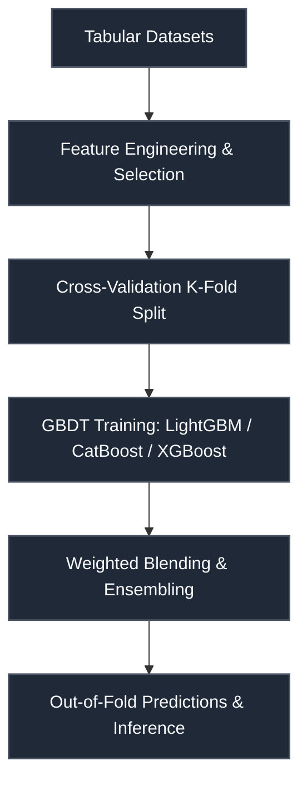

# NeurIPS 2025 — Open Polymer Challenge

 

> **Host:** [`University of Notre Dame & University of Wisconsin-Madison`]  
> **Platform Link:** [Kaggle Competition](https://www.kaggle.com/competitions/neurips-2025-open-polymer-challenge)  
> **Dataset Link:** [Kaggle Dataset](https://www.kaggle.com/competitions/neurips-2025-open-polymer-challenge/data)  
> **Domain:** `Materials Science & Chemistry`

## Overview

This repository contains the developmental workspace and notebooks for the **NeurIPS 2025 — Open Polymer Challenge** project. The primary focus of this project is in the domain of **Materials Science & Chemistry** on University of Notre Dame & University of Wisconsin-Madison. The codebase represents an iterative implementation of machine learning pipelines, structured to process datasets, train models, and validate predictions.

### Technical Methodology & Implementation

The codebase features a total of 366 cells across 35 notebook(s). The system implements several key architectural elements:
- **Core Classes**: Custom object-oriented structures are defined to manage state and logic, including: `AdvancedGNN`, `AdvancedMolecularDataset`, `AdvancedSMILESToGraph`, `EnhancedMolecularDataset`, `FocalLoss`, `ImprovedSMILESToGraph`.
- **Key Algorithms & Utilities**: Procedural helpers and utilities facilitate operations, notably: `__getitem__`, `__init__`, `__len__`, `_init_weights`, `advanced_collate_fn`, `collate_fn`, `create_data_loaders`, `create_dummy_graph`.
- **Training & Optimization**: Includes optimization via Adam, cross-validation strategy for stable predictions.

## System Architecture

## Notebook Architecture

### Inference & Submission

| Notebook / Script | Type | Versions | Average Size | Core Stack / Techniques |
| :--- | :--- | :--- | :--- | :--- |
| [Inference](./Inference%20%26%20Submission/Inference.ipynb) | Single Notebook | v1 | 82 KB | PyTorch, Scikit-Learn |
| [Inference_2](./Inference%20%26%20Submission/Inference_2.ipynb) | Single Notebook | v1 | 32 KB | PyTorch, Scikit-Learn |
| **Inference_3** | Multi-Version Script | [v1](./Inference%20%26%20Submission/Inference_3/v1.ipynb), [v2](./Inference%20%26%20Submission/Inference_3/v2.ipynb), [v3](./Inference%20%26%20Submission/Inference_3/v3.ipynb), [v4](./Inference%20%26%20Submission/Inference_3/v4.ipynb), [v5](./Inference%20%26%20Submission/Inference_3/v5.ipynb), [v6](./Inference%20%26%20Submission/Inference_3/v6.ipynb) | 1.1 MB | PyTorch, Scikit-Learn |
| **Inference_4** | Multi-Version Script | [v1](./Inference%20%26%20Submission/Inference_4/v1.ipynb), [v2](./Inference%20%26%20Submission/Inference_4/v2.ipynb), [v3](./Inference%20%26%20Submission/Inference_4/v3.ipynb) | 172 KB | PyTorch, Scikit-Learn |
| **LightGBM_LightGBM_XGBoost_XGBoost_CatBoost_Inference** | Multi-Version Script | [v1](./Inference%20%26%20Submission/LightGBM_LightGBM_XGBoost_XGBoost_CatBoost_Inference/v1.ipynb), [v2](./Inference%20%26%20Submission/LightGBM_LightGBM_XGBoost_XGBoost_CatBoost_Inference/v2.ipynb), [v3](./Inference%20%26%20Submission/LightGBM_LightGBM_XGBoost_XGBoost_CatBoost_Inference/v3.ipynb), [v4](./Inference%20%26%20Submission/LightGBM_LightGBM_XGBoost_XGBoost_CatBoost_Inference/v4.ipynb), [v5](./Inference%20%26%20Submission/LightGBM_LightGBM_XGBoost_XGBoost_CatBoost_Inference/v5.ipynb), [v6](./Inference%20%26%20Submission/LightGBM_LightGBM_XGBoost_XGBoost_CatBoost_Inference/v6.ipynb), [v7](./Inference%20%26%20Submission/LightGBM_LightGBM_XGBoost_XGBoost_CatBoost_Inference/v7.ipynb), [v8](./Inference%20%26%20Submission/LightGBM_LightGBM_XGBoost_XGBoost_CatBoost_Inference/v8.ipynb), [v9](./Inference%20%26%20Submission/LightGBM_LightGBM_XGBoost_XGBoost_CatBoost_Inference/v9.ipynb), [v10](./Inference%20%26%20Submission/LightGBM_LightGBM_XGBoost_XGBoost_CatBoost_Inference/v10.ipynb), [v11](./Inference%20%26%20Submission/LightGBM_LightGBM_XGBoost_XGBoost_CatBoost_Inference/v11.ipynb), [v12](./Inference%20%26%20Submission/LightGBM_LightGBM_XGBoost_XGBoost_CatBoost_Inference/v12.ipynb), [v13](./Inference%20%26%20Submission/LightGBM_LightGBM_XGBoost_XGBoost_CatBoost_Inference/v13.ipynb), [v14](./Inference%20%26%20Submission/LightGBM_LightGBM_XGBoost_XGBoost_CatBoost_Inference/v14.ipynb), [v15](./Inference%20%26%20Submission/LightGBM_LightGBM_XGBoost_XGBoost_CatBoost_Inference/v15.ipynb), [v16](./Inference%20%26%20Submission/LightGBM_LightGBM_XGBoost_XGBoost_CatBoost_Inference/v16.ipynb), [v17](./Inference%20%26%20Submission/LightGBM_LightGBM_XGBoost_XGBoost_CatBoost_Inference/v17.ipynb), [v18](./Inference%20%26%20Submission/LightGBM_LightGBM_XGBoost_XGBoost_CatBoost_Inference/v18.ipynb), [v19](./Inference%20%26%20Submission/LightGBM_LightGBM_XGBoost_XGBoost_CatBoost_Inference/v19.ipynb) | 57 KB | CatBoost, LightGBM, Requests API, Scikit-Learn, XGBoost |
| **LightGBM_LightGBM_XGBoost_XGBoost_CatBoost_SVM_DecisionTree_Inference** | Multi-Version Script | [v1](./Inference%20%26%20Submission/LightGBM_LightGBM_XGBoost_XGBoost_CatBoost_SVM_DecisionTree_Inference/v1.ipynb), [v2](./Inference%20%26%20Submission/LightGBM_LightGBM_XGBoost_XGBoost_CatBoost_SVM_DecisionTree_Inference/v2.ipynb), [v3](./Inference%20%26%20Submission/LightGBM_LightGBM_XGBoost_XGBoost_CatBoost_SVM_DecisionTree_Inference/v3.ipynb), [v4](./Inference%20%26%20Submission/LightGBM_LightGBM_XGBoost_XGBoost_CatBoost_SVM_DecisionTree_Inference/v4.ipynb), [v5](./Inference%20%26%20Submission/LightGBM_LightGBM_XGBoost_XGBoost_CatBoost_SVM_DecisionTree_Inference/v5.ipynb) | 32 KB | CatBoost, LightGBM, Requests API, Scikit-Learn, XGBoost |

## Navigation Guidelines

> **Stage Guidelines**
>
- **EDA & Preprocessing**: Verify data loaders and inspect class distributions before model design.
- **Training & Validation**: Check training runs, loss curves, and model validation scores to evaluate performance.
- **Inference & Ensembling**: Run predictions on testing files and verify submission formatting.

---

> "We arrange atoms to bend reality, unaware of the structural limits of our creations."
>
> — **Vigneshwaran S**
